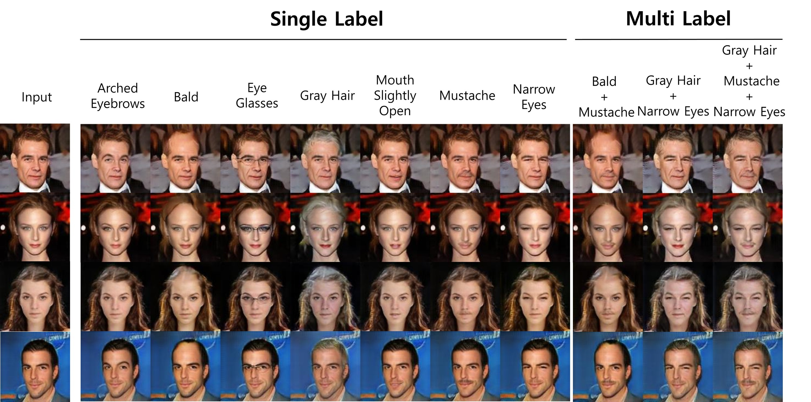

# SuperstarGAN: Generative adversarial networks for image-to-image translation in large-scale domains
## [Paper](https://www.sciencedirect.com/science/article/pii/S0893608023001144?via%3Dihub)

<p align="center"></p>


## Training/Testing networks
To train SuperstarGAN on AFHQ, you must sort the dataset directory as [AFHQ](https://github.com/KangHyeokKo/SuperstarGAN/blob/main/jpg/AFHQ.md).

To train SuperstarGAN on CelebA or AFHQ, run the training script below. 

```bash
# Train SuperstarGAN using the CelebA dataset:
python main.py 

# Train SuperstarGAN using the AFHQ dataset:
python main.py --dataset AFHQ --c_dim 7 --log_dir superstargan/afhq/logs --model_save_dir superstarGAN/afhq/models \
               --sample_dir superstarGAN/afhq/samples --result_dir superstarGAN/afhq/results

# Test SuperstartarGAN using the CelebA dataset:
python main.py --mode test 

# Test SuperstartarGAN using the AFHQ dataset:
python main.py --mode test --dataset AFHQ --c_dim 7 --log_dir superstargan/afhq/logs --model_save_dir superstarGAN/afhq/models \
               --sample_dir superstarGAN/afhq/samples --result_dir superstarGAN/afhq/results
```

## Acknowledgements
This research was supported by the Chung-Ang University Graduate Research Scholarship in 2022 as well as the National Research Foundation of Korea (NRF) grant funded by the Korea government (MSIT) (No. 2021R1F1A1050977).

The source code is based on the Original [StarGAN](https://github.com/yunjey/stargan) source code
 
